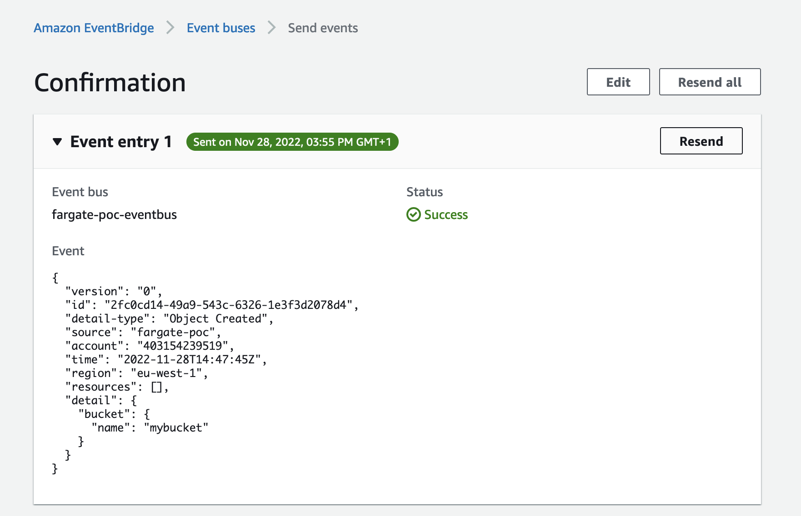
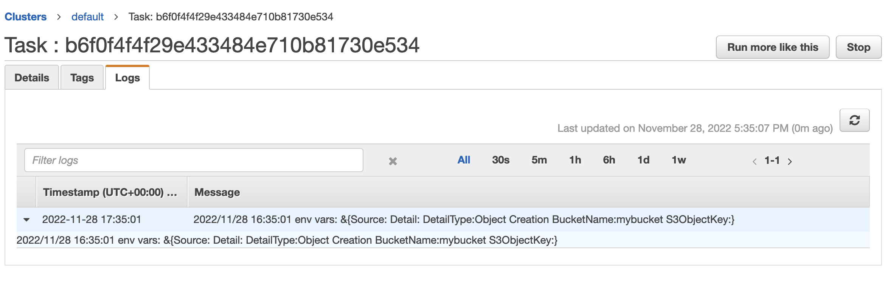

requirements:
- ecr repo
- arm64 (or change cpuArchitecture for taskDef)

container build:

```
cd source
docker build -t <accountNr>.dkr.ecr.eu-west-1.amazonaws.com/eventbridge-fargate-poc:latest .
docker push <accountNr>.dkr.ecr.eu-west-1.amazonaws.com/eventbridge-fargate-poc:latest
```

template deployment:
```
sam build
sam deploy
```

event:


fargate run logs:


downsides:
- slow Fargate task provision for big containers
- no GPU support yet :/
